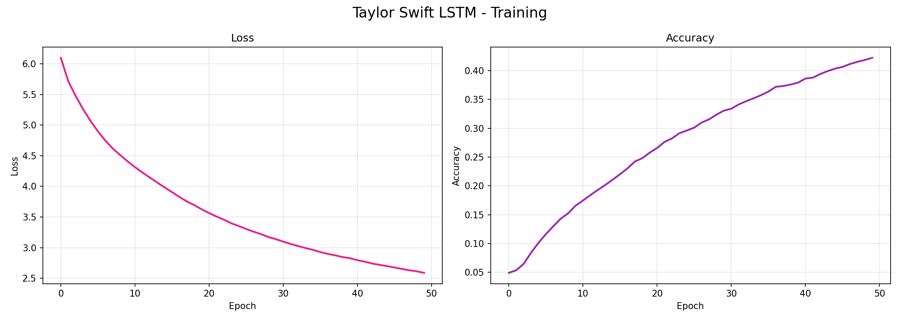

# 🎵 Taylor Swift Lyrics Generator — LSTM

Génération automatique de paroles de chansons dans le style de Taylor Swift en utilisant un réseau de neurones récurrents (**RNN**) de type **LSTM** (Long Short-Term Memory).


---

## 📌 Présentation du Projet

Ce projet utilise l'apprentissage profond pour capturer l'essence de l'écriture de Taylor Swift. En entraînant un modèle sur un corpus de paroles s'étendant de son premier album éponyme jusqu'à *reputation*, l'IA apprend les structures de phrases, le vocabulaire et les thèmes récurrents de l'artiste.

### Objectifs :
- **Prétraitement** : Nettoyage et tokenisation d'un dataset de ~4800 lignes de paroles.
- **Modélisation** : Architecture LSTM multicouche pour capturer les dépendances textuelles à long terme.
- **Génération** : Création de nouvelles paroles à partir d'une "graine" (seed text) avec contrôle de la créativité via la température.

---

## 📊 Performance du Modèle

Le modèle a été entraîné sur 50 époques. Voici les courbes d'apprentissage montrant l'évolution de la perte (Loss) et de la précision (Accuracy) :



> [!NOTE]
> Le modèle atteint une précision par mot d'environ **42%**, ce qui permet de générer des phrases cohérentes tout en gardant une certaine liberté créative "Swiftienne".

---

## 🎤 Exemples de Génération

Voici quelques paroles générées par l'IA (en utilisant différentes "seeds") :

*   **Seed :** *"i knew you were trouble"*
    *   **IA :** *"...away the story of us honey you know you better now i just know that right what you want call it what you want it"*
*   **Seed :** *"we are never getting back together"*
    *   **IA :** *"...down around break here as a daydream and like i know with my names at my whole scene and know now this is so mine"*
*   **Seed :** *"shake it off"*
    *   **IA :** *"...i shake it off i shake it off i shake it off i shake it off..."* (Boucle rythmique typique !)

---

## 🛠️ Installation et Utilisation

### 1. Prérequis
Assurez-vous d'avoir Python 3.9 installé. L'utilisation d'Anaconda est recommandée.

### 2. Configuration de l'environnement
```bash
# Créer l'environnement
conda create -n lstm_taylor python=3.9 -y
conda activate lstm_taylor

# Installer les dépendances
pip install numpy pandas matplotlib tensorflow keras scikit-learn jupyter ipykernel
```

### 3. Utilisation dans VS Code
1. Ouvrez le dossier `lstm_project` dans VS Code.
2. Ouvrez le fichier `lstm_taylor_swift.ipynb`.
3. Cliquez sur **"Select Kernel"** en haut à droite et choisissez `lstm_taylor`.
4. Exécutez les cellules pour entraîner ou tester le modèle.

---

## 📁 Structure des Fichiers

```text
lstm_project/
│
├── lstm_taylor_swift.ipynb   # Notebook principal (Entraînement & Génération)
├── taylor_swift_lyrics.csv   # Dataset (Albums : Debut → Reputation)
├── taylor_swift_lstm.keras   # Modèle entraîné sauvegardé
├── tokenizer.pkl             # Vocabulaire sauvegardé
├── training_curves.png       # Visualisation des performances
└── README.md                 # Documentation du projet
```

---

## 🧠 Détails Techniques

- **Dataset** : 94 chansons, 4862 lignes de paroles.
- **Architecture du Modèle** :
  - `Embedding Layer` : Vecteurs de dimension 100.
  - `LSTM Layer (150 units)` : Avec `return_sequences=True`.
  - `Dropout (0.2)` : Pour éviter le sur-apprentissage.
  - `LSTM Layer (100 units)`.
  - `Dropout (0.2)`.
  - `Dense Layer (Softmax)` : Sortie sur la taille du vocabulaire (2381 mots).
- **Optimiseur** : Adam.
- **Loss Function** : Categorical Crossentropy.

---

## 📜 Licence
Ce projet est destiné à des fins éducatives et expérimentales. Les paroles originales appartiennent à Taylor Swift.